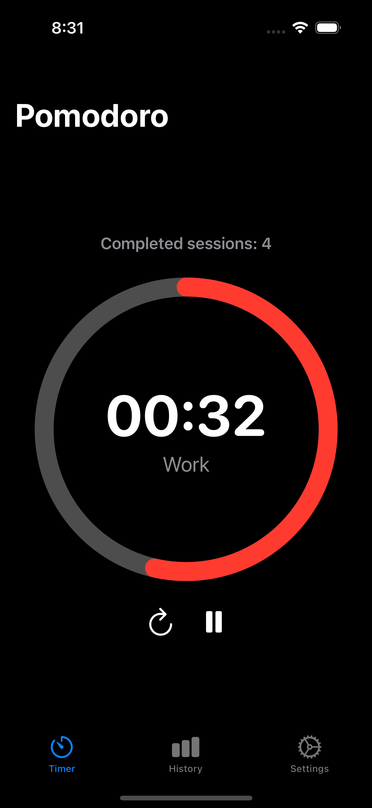

# Pomodoro App

A feature-rich, modern iOS application for time management using the Pomodoro Technique, helping users enhance productivity by breaking work into intervals separated by short breaks.



## Features

### Core Timer Functionality

- **Customizable Work/Break Periods**: Adjust work sessions (default: 25 min), short breaks (default: 5 min), and long breaks (default: 15 min)
- **Session Management**: Automatically tracks completed Pomodoro sessions
- **Break Intervals**: Configure the number of sessions until a long break (default: 4)
- **Auto Start Options**: Optionally auto-start work sessions or breaks
- **Visual Progress**: Circular progress indicator shows remaining time
- **Configurable Colors**: Customize timer colors for work and break periods

### Notifications & Alerts

- **Session End Alerts**: Receive notifications when work or break periods end
- **Background Notifications**: Notifications work even when the app is in the background
- **Sound Toggles**: Enable/disable notification sounds
- **Permission Management**: Streamlined process to handle notification permissions

### History & Statistics

- **Comprehensive History**: View completed Pomodoro sessions by day, week, or month
- **Calendar View**: Navigate to any past date to view sessions
- **Productivity Analysis**: See your most productive days and times
- **Detailed Statistics**: Track total sessions, total focused time, and productivity patterns
- **Data Visualization**: Charts showing productivity by day of the week and time of day
- **Data Management**: Options to clear all history or just data older than 30 days

### Customization & Settings

- **Theme Selection**: Choose between light, dark, or system theme
- **Interface Language**: Full support for English, Spanish, and Portuguese
- **iCloud Sync**: Synchronize your Pomodoro history across devices
- **Restore Defaults**: Easily reset settings to default values

## Technical Details

### Architecture

- **Design Pattern**: MVVM (Model-View-ViewModel)
- **UI Framework**: SwiftUI for a modern, responsive interface
- **Persistence**: UserDefaults for settings, local storage for session history
- **Cloud Integration**: CloudKit for optional iCloud synchronization
- **Background Tasks**: Support for background execution to maintain timer accuracy
- **Localization**: Complete internationalization support

### Code Organization

The app is organized into a clean, modular structure:

```
pomodoro/
├── Core/
│   ├── Extensions/
│   ├── Models/
│   └── Services/
├── Features/
│   ├── Timer/
│   ├── History/
│   └── Settings/
├── Resources/
│   └── Localization/
└── UI/
    └── Components/
```

- **Core**: Fundamental components including models, services, and extensions
- **Features**: Main app features separated by domain (Timer, History, Settings)
- **Resources**: Assets and localization files
- **UI**: Reusable UI components

## Requirements

- iOS 16.0+
- Xcode 15.0+
- Swift 5.9+

## Installation

1. Clone the repository
2. Open the project in Xcode
3. Build and run on your device or simulator

## Usage

1. **Start a Focus Session**: Select your desired work duration and tap the start button
2. **Take Breaks**: When a work session ends, the app will notify you and initiate a break
3. **Track Progress**: Visit the History tab to analyze your productivity patterns
4. **Customize Settings**: Adjust timer durations, notification preferences, and appearance in the Settings tab

## Contributing

Contributions are welcome! Please feel free to submit a Pull Request.

## License

This project is licensed under the MIT License - see the LICENSE file for details.

## Acknowledgements

- The Pomodoro Technique® is a registered trademark of Francesco Cirillo
- Icons provided by SF Symbols
